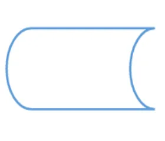
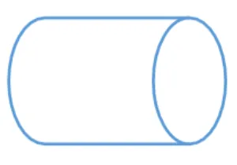
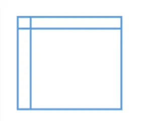
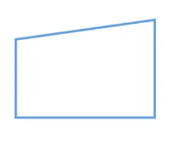

# Akış Şemaları
Akış Şemaları projelerde herhangi bir sorunun çözümü için izlenecek yolların sembollerle ifade ediliş biçimidir.

## Akış Şemaları Sembolleri
### Başla & Dur
Akış şemasının nerede başladığını ve nerede bittiğini göstermek için kullanılır. Sembolün içine “Başlangıç” ve “Bitiş” gibi belirleyici ifadeler eklerseniz şemanın daha anlaşılır olmasını sağlayabilirsiniz.

  

### İşlem
Aritmetik, analitik ya da mantıksal herhangi hesaplama ya da atama işlemi yapmak için kullanılır. Sembol içerisine akışın o adımına gelindiğinde uygulanması gereken işlem ifadeleri yazılır.

  

### Veri(Girdi/Çıktı)
Bilgi girişlerini ya da elde edilecek sonuçları gösteren semboldür.

  

### Karar
Akışta kapalı uçlu bir soru sormak için kullanılır. Sorunun cevapları ‘Evet’ ya da ‘Doğru’ ve ‘Hayır’ ya da ‘Yanlış’ olarak iki farklı kararı temsil eder. Akışta kafa karışıklığını önlemek için karar sembolünden çıkan okların üzerinde hangi cevabı temsil ettiği yazılmalıdır.

  

### Belge
Akış sırasında kullanıcıya yansıtılacak belge ya da raporu gösterir.

  

### Depolama
Depolanacak veriyi ve tutulacağı ortamı belirtmek için kullanılır.

  

### Veri Ambarı
Bilgisayarın hard diski gibi doğrudan erişilebilen veir ambarını temsil eder.

  

### İç Depolama
Programlama için çizilen akış şemalarında hafızada tutulan bilgiyi ifade etmek için kullanılır. Genellikle lokal bilgisayardaki belleği temsil edeir.

  

### Teyp Kütüğü
Manyetik bant şeklinde olan bu sembol bir dizi halde saklanan bilgiyi ifade eder.

  

### Manuel Girdi
Kullanıcı tarafından manuel olarak sistemde alınacak aksiyon adımlarını anlatır.

  

### Önceden Tanımlı İşlem
Daha önceden çizilmiş olmaıs gereken bir akış şemasını ifade eder, daha fazla detay için bu akış şemasına referans verilebilir.

  

### Hazırlık / Döngü
Hazırlık evresini anlatan her türlü işlemi ya da tekrar edecek bir sürecin başlangıcını gösterir. Çalışmak üzere hazırlanan ve gerçekten çalışan adımları birbirinden ayırmaya yarar.

  

### Bekleme
Süreçteki gecikmeye veya bekleme süresine işaret eder.

  

### Bağlantı
İki farklı akışın birleşme yerini gösterir. Uzun ve detaylı akış şemalarını birbirine bağlamada kullanılır; aynı ya da farklı sayfadaki bir akışa yönlendirme yapar.

  
