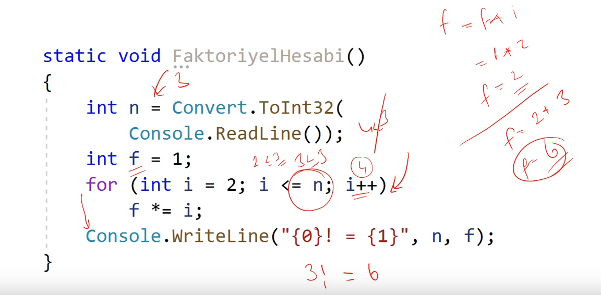
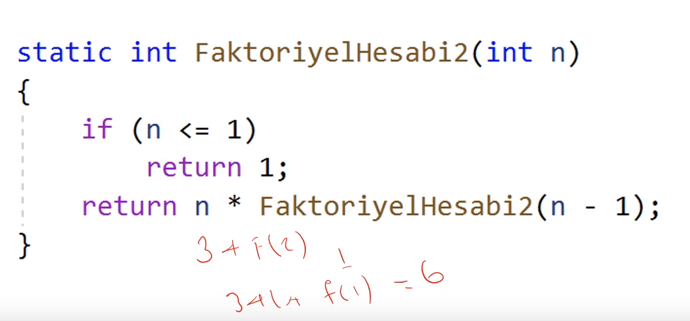
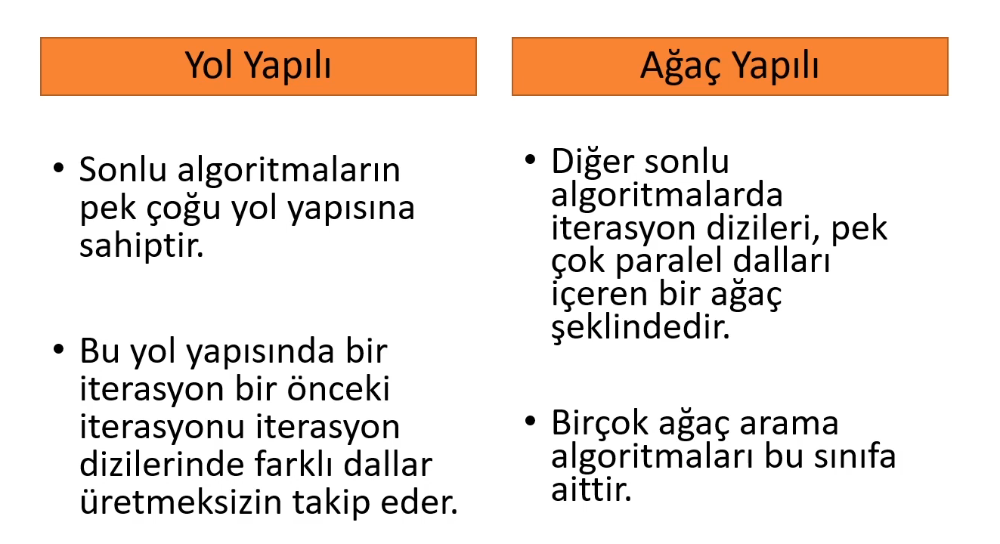

## Algoritma Türleri
- Algoritmalar prosedürleri işletme şekillerinden dolayı farklı kategorilere ayrılmaktadır.
- Bu farklılıklar algoritmaların çalışma şekillerine ve yapılarına yansımaktadır.

  

### Direkt Algoritmalar
- Algoritmaların en temel çalışma bileşenlerindne biri iterasyonlardır.
- İterasyon, belirli koşullar altında kendini tekrar eden kod blokları oalrak ifade edilebilir.
- İterasyonlarla çalışmayan algoritmalar **direkt algoritmalar** olarak isimlendirilir.

### Ardışık Algoritmalar
- Direkt algoritmaların aksine amaçlanan problemin çözümünü yerine geritmek üzere pek çok algoritma ardışık olarak çalışır ve bu algoritmalara **ardışık algoritmalar** olarak adlandırılır.
- Örnek olarak bir faktöriyel hesabına bakalım:

  
  

### Yakınsak Algoritmalar
- Aranılan çözüme doğru yakınsayan ardışık algoritmalardır.
- Bazı yakınsak algoritmalar kesin çözümü elde edemezler, fakat bu çözüme yaklaşık bir değeri kesin çözüm alırlar.
- Yaklaşık algoritmalar sonlu değillerdir; fakat her bir ileri iterasyon onları kesin çözüme biraz daha yaklaştırır.
- Yaklaşık algoritmalara Değişken Kesen Metodu, Arama Teknikleri vb. çok bilinen bir kaç örnek verilebilir.

### Sonlu Algoritmalar
- Sonlu algoritmalar, iterasyonların sonlu bir sayısında kesin çözümü garanti eden yakınsak algoritmalardır ve kendi arasında **yol yapılı** ve **ağaç yapılı** olmak üzere ikiye ayrılırlar.

  

