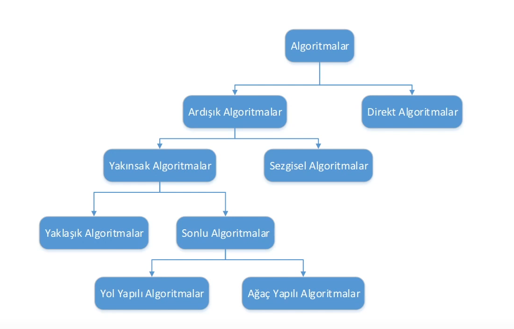

## Algoritma Türleri
- Algoritmalar prosedürleri işletme şekillerinden dolayı farklı kategorilere ayrılmaktadır.
- Bu farklılıklar algoritmaların çalışma şekillerine ve yapılarına yansımaktadır.

  