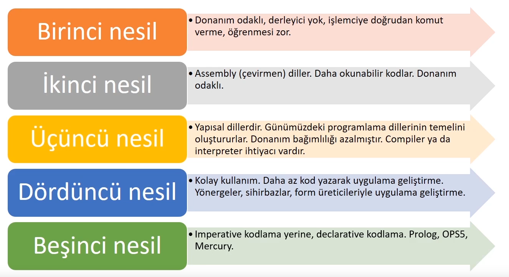

# Programlamaya Giriş
Programlama, günlük hayattaki genel veya özel problemlerin makinelere tanıtılması öğretilmesi ve öğretilen çözüm yolları ile sonuca ulaştırılmasını sağlamak amacıyla kullanılan teknik bir terimdir. Programlama, problemin tespiti ile başlayıp ürünün elde edilmesi, dağıtılması ve bakım süreçlerinin tamamını kapsayan bir süreç olarak düşünülmelidir.

IDE: Integrated Development Enviroment (Tümleşik geliştirme ortamı)

## Programlama Dilleri 
  